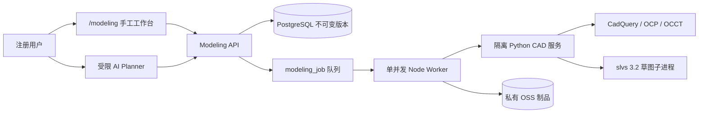

# OpenVac 智能建模引擎 V1

## 当前状态

本分支实现的是可验证的 V1 工程基线，不是已经通过目标服务器验收的生产发布。生产配置默认 `MODELING_ENABLED=false`；只有通用 CAD、装配/互操作、原创旋片泵三层门槛全部留有测试证据后，才可显式打开。

现有 `/api/chat` 仍只负责有证据的问答。CAD 项目、版本、计划、任务和制品均使用独立 `/api/modeling/**` 边界，AI 不能执行 Python、Shell 或任意 CadQuery 代码。

## 架构与信任边界



- `openvac.modeling.v1` 是唯一被接受的协议。对象使用稳定 UUID 与语义引用，协议解析拒绝未知字段、悬空引用和裸面序号。
- 手工提交先在真实 B-Rep 内核干跑；内核拒绝时不会推进 `current_revision_id`。
- AI 只形成 `ModelingPlanDraft`。缺尺寸、单位或对象时返回 `missingInputs`；完整计划先干跑、展示差异与警告，用户确认后才产生不可变版本。基础版本改变会使计划失效。
- AI 不仅校验参数操作，也检查新增或修改的草图坐标、组件位移和特征角度。提示词没有明确确认的非零长度或角度会被视为缺失输入；知识检索和模型常识都不能替用户补成制造尺寸。
- SolveSpace 在独立子进程内串行执行；建模服务无业务数据库权限。容器丢弃 Linux capabilities、只读根文件系统、禁用外网，仅可通过内部网络访问。
- STEP 直传受 50 MB、所有权前缀、内容类型、长度、SHA-256 和服务端对象元数据共同约束。预签名先写入持久化上传意图；相同幂等键只允许相同载荷重签，完成确认必须命中原意图，且意图完成和导入任务入队在同一事务内。导入只产生一个 `imported_step` 基础实体特征，不伪造原始历史；该基础实体可继续接孔、圆角等原生下游特征，并在同一 OCCT 历史中重建。
- 装配约束只对零件局部原点与局部 Z 轴这组确定性 datum 求解，覆盖固定、重合、同轴和距离。V1 不推断任意 B-Rep 面配合，也不接受易漂移的拓扑序号。
- 同步权威校验和异步 CAD 任务共用数据库 advisory lock、全局/用户容量以及每日计算账本。运行任务按超时上限预留预算，终态按内核实际耗时结算，避免并发请求穿透配额。

## 已实现能力

- 参数、草图、特征、零件实例、装配约束、操作批次、AI 计划、构建结果的严格协议与哈希。
- 体积、表面积、包络和质心直接来自 B-Rep。质量只有在新建项目时由用户显式填写正数材料密度后才按 `体积 × 密度` 返回；未填写时协议返回 `massKg=null` 与 `unavailable_density_required`，不猜材料、牌号或厂商数据。
- 点、线、折线、矩形、圆、圆弧、长圆槽及常用二维约束；返回自由度、冗余、冲突、不收敛和非法几何诊断。
- 拉伸/切除、旋转/开槽、孔、布尔、圆角、倒角、镜像、线性/圆周阵列、重排和抑制的确定性解释器。
- STEP、STL、GLB 真实导出；制品登记前运行时读回：STEP 重导入检查闭合实体、包络和体积容差，STL/GLB 重新加载检查非空网格、单位尺度与包络。
- 项目与不可变版本 API、幂等提交、所有权隔离、取消、可用 `Last-Event-ID` 续接的 SSE、队列与用户配额。
- Worker 的每次执行使用 `jobId + leaseToken` 独立命名空间；租约失效后的旧执行不能覆盖或清理新执行制品。AI 计划、干跑结果、制品账本、任务终态和事件原子提交，服务重启可从已落库结果恢复而不重复调用模型。
- 同步建模服务在成功、校验失败、校验和失败和超时路径都清理任务临时目录；清理本身失败时会失败关闭，不推进项目版本。
- 左树/中视口/右参数/底命令区工作台，以及选择、隐藏、隔离、测量、剖切和干涉提示。
- 原创通用单级旋片泵模板是严格的固定 recipe 参数化模板，而不是任意泵特征树解释器。V1 支持声明参数的编辑；删除、抑制、重排或改写 recipe 结构会在 B-Rep 前失败关闭。其尺寸是 OpenVac 自有示例参数，不来源于任何厂商或专利产品。
- 固定 recipe 显式包含前后端盖草图、挤出特征、组件和装配约束；端盖外圆以泵腔轴线为中心，轴孔以偏心主轴轴线为中心。端盖外径、厚度和轴孔直径由公开模板参数确定性派生，不接受伪造的独立历史。
- 偏心距、泵腔直径、轴径和轴向宽度的修改会展开为显式的派生操作，同步转子中心、端盖孔、阵列轴和组件位姿；若语义引用漂移则在进入内核前失败关闭。
- 进排气口是从壳体径向切除的真实 B-Rep 通道，不是并入壳体的装饰圆柱。内核通过 OCCT 实体交集分别证明切除体积、泵腔侧相交、外界侧相交以及切后残余堵塞体积为零。
- 专业几何验收将解析预检与 OCCT 证据分层：有效规格按不大于 1° 的步长构造 360 个旋转位置，检查转子/滑片/主轴/泵腔实体干涉、滑片端隙和端口喉口开闭，并对检测到的碰撞边界继续细化。`brep_checked=true` 表示确已调用 OCCT；已有硬参数错误的规格只执行静态 B-Rep 失败证据，不冒充完成整周验收。

## 本地运行

要求 Node.js 24、pnpm 10、Python 3.12，以及提供 PostgreSQL/pgvector 的 Docker Compose。

```bash
cp .env.example .env
# 仅在开发环境显式打开；生产仍保持 false
# MODELING_ENABLED=true
pnpm install
python3.12 -m venv modeling-service/.venv
modeling-service/.venv/bin/pip install -e 'modeling-service[test]'
test -n "$MODELING_SERVICE_TOKEN" # profile fails closed without an internal token
docker compose --profile modeling up -d postgres modeling-service
pnpm db:migrate
pnpm dev
pnpm modeling:worker
```

确定性验证：

```bash
pnpm typecheck
pnpm vitest run src/lib/modeling src/server/modeling src/modeling-worker src/components/modeling
modeling-service/.venv/bin/python -m pytest -q
modeling-service/.venv/bin/python -m app.benchmark --case all --iterations 20
```

## 默认运行限制

| 限制                |                               默认值 |
| ------------------- | -----------------------------------: |
| 全局内核并发 / 队列 |                               1 / 20 |
| 单用户运行 / 排队   |                                1 / 2 |
| STEP 大小           |                                50 MB |
| 交互 / 重任务超时   |                       30 秒 / 180 秒 |
| 子进程上限          | 2 vCPU、4 GB、64 PIDs、2 GB 临时空间 |
| 每用户每日内核时间  |                             1,200 秒 |
| 每用户每日重型导出  |                                10 次 |
| 权威手工提交        |                           30 次/分钟 |
| 预览 / 导出缓存     |                         30 天 / 7 天 |

## 只读监控与验收运行手册

本节是上线前可执行的观测基线，**不表示监控已经部署**。SQL 只能由只读数据库角色运行；建议在监控连接上设置 `default_transaction_read_only=on`、5 秒查询超时，并限制到 `modeling_*` 表。时间聚合窗口统一为最近 24 小时，当前队列快照则覆盖全部仍在排队的任务；正式告警系统应保留查询结果、采样时间、部署版本和目标主机标识，不能用开发机结果冒充目标机证据。

队列深度、最老排队任务、队列等待 P95 和任务执行 P95：

```sql
BEGIN TRANSACTION READ ONLY;
SET LOCAL statement_timeout = '5s';

SELECT
  clock_timestamp() AS sampled_at,
  count(*) AS queue_depth,
  round(
    extract(epoch FROM max(clock_timestamp() - created_at))::numeric,
    3
  ) AS oldest_queued_seconds
FROM modeling_job
WHERE status = 'queued';

SELECT
  kind,
  count(*) FILTER (WHERE started_at IS NOT NULL) AS started_jobs,
  round(
    (
      percentile_cont(0.95) WITHIN GROUP (
        ORDER BY extract(epoch FROM (started_at - created_at))
      ) FILTER (WHERE started_at IS NOT NULL) * 1000
    )::numeric,
    3
  ) AS queue_wait_p95_ms,
  round(
    (
      percentile_cont(0.95) WITHIN GROUP (
        ORDER BY extract(epoch FROM (completed_at - started_at))
      ) FILTER (
        WHERE started_at IS NOT NULL
          AND completed_at IS NOT NULL
          AND status IN ('succeeded', 'failed', 'cancelled')
      ) * 1000
    )::numeric,
    3
  ) AS execution_p95_ms
FROM modeling_job
WHERE created_at >= clock_timestamp() - interval '24 hours'
GROUP BY kind
ORDER BY kind;

COMMIT;
```

内核失败、超时和 worker 故障必须同时看异步任务与同步权威校验。该查询保留原始错误码，避免把用户几何错误误报成内核崩溃：

```sql
BEGIN TRANSACTION READ ONLY;
SET LOCAL statement_timeout = '5s';

WITH failures AS (
  SELECT
    created_at,
    'job'::text AS channel,
    coalesce(error_code, 'UNCLASSIFIED') AS error_code,
    coalesce(error_message, '') AS error_message
  FROM modeling_job
  WHERE status = 'failed'
    AND created_at >= clock_timestamp() - interval '24 hours'
  UNION ALL
  SELECT
    created_at,
    'direct_validation'::text AS channel,
    coalesce(error_code, 'UNCLASSIFIED') AS error_code,
    coalesce(error_message, '') AS error_message
  FROM modeling_validation_attempt
  WHERE status = 'failed'
    AND created_at >= clock_timestamp() - interval '24 hours'
)
SELECT
  channel,
  error_code,
  count(*) AS failures,
  count(*) FILTER (
    WHERE error_code ILIKE '%TIMEOUT%'
       OR error_message ILIKE '%timeout%'
       OR error_message LIKE '%超时%'
  ) AS timeout_failures,
  min(created_at) AS first_seen,
  max(created_at) AS last_seen
FROM failures
GROUP BY channel, error_code
ORDER BY failures DESC, channel, error_code;

COMMIT;
```

无效模型与明确 `BREP_INVALID` 的比例分开统计。`CAD_VALIDATION_FAILED` 是“内核拒绝”，不必然等于无效 B-Rep；只有诊断码证据才进入 `brep_invalid`：

```sql
BEGIN TRANSACTION READ ONLY;
SET LOCAL statement_timeout = '5s';

WITH validation_outcomes AS (
  SELECT
    status::text AS status,
    error_code,
    EXISTS (
      SELECT 1
      FROM jsonb_array_elements(
        coalesce(error_details -> 'diagnostics', '[]'::jsonb)
      ) AS diagnostic
      WHERE diagnostic ->> 'code' = 'BREP_INVALID'
         OR diagnostic ->> 'code' LIKE 'PUMP_BREP_INVALID%'
    ) AS brep_invalid
  FROM modeling_validation_attempt
  WHERE status IN ('succeeded', 'failed')
    AND created_at >= clock_timestamp() - interval '24 hours'
),
job_outcomes AS (
  SELECT
    status::text AS status,
    error_code,
    error_message ILIKE '%BREP_INVALID%' AS brep_invalid
  FROM modeling_job
  WHERE status IN ('succeeded', 'failed', 'cancelled')
    AND kind IN ('build', 'preview', 'export', 'import', 'conversion')
    AND created_at >= clock_timestamp() - interval '24 hours'
),
outcomes AS (
  SELECT 'direct_validation'::text AS channel, * FROM validation_outcomes
  UNION ALL
  SELECT 'job'::text AS channel, * FROM job_outcomes
)
SELECT
  channel,
  count(*) AS completed_attempts,
  count(*) FILTER (WHERE status = 'failed') AS failed_attempts,
  count(*) FILTER (
    WHERE error_code IN ('CAD_VALIDATION_FAILED', 'CAD_BUILD_INVALID')
  ) AS deterministic_rejections,
  count(*) FILTER (WHERE brep_invalid) AS brep_invalid,
  round(
    100.0 * count(*) FILTER (WHERE brep_invalid) / nullif(count(*), 0),
    3
  ) AS brep_invalid_percent
FROM outcomes
GROUP BY channel
ORDER BY channel;

COMMIT;
```

数据库中的 OSS 制品账本、已过期待清理量及按类型占用：

```sql
BEGIN TRANSACTION READ ONLY;
SET LOCAL statement_timeout = '5s';

SELECT
  kind,
  count(*) AS objects,
  sum(size_bytes) AS bytes,
  pg_size_pretty(sum(size_bytes)::bigint) AS readable_size,
  count(*) FILTER (WHERE expires_at <= clock_timestamp()) AS expired_objects,
  coalesce(
    sum(size_bytes) FILTER (WHERE expires_at <= clock_timestamp()),
    0
  ) AS expired_bytes
FROM modeling_artifact
GROUP BY kind
ORDER BY bytes DESC;

COMMIT;
```

该账本查询不能证明 OSS 实际对象一定存在，也不能发现未登记的孤儿对象；上线验收还要把它与 OSS 控制台或供应商只读用量指标对账。宿主机巡检使用只读命令，至少记录建模服务和 worker 的 CPU/内存、容器重启次数、Docker 占用、目标挂载点磁盘与 inode：

```bash
docker compose --profile modeling ps
docker compose --profile modeling stats --no-stream modeling-service modeling-worker
docker system df
df -h /var/lib/docker /tmp
df -i /var/lib/docker /tmp
```

若目标主机路径不同，应替换为实际 Docker data-root 和 `MODELING_ARTIFACT_ROOT` 所在挂载点。建议至少对“队列持续增长或最老等待超过交互时限、任一超时/内核不可用、B-Rep 无效率非零、内存接近 4 GB 限额、磁盘或 inode 使用率超过 80%”告警；阈值在压测后冻结，并做一次只关闭 `MODELING_ENABLED`、问答服务继续可用的故障演练。

## 上线门槛

不得用单元测试代替以下目标机证据：

1. 通用 CAD：黄金草图、全部首版特征、参数重建、非法布尔/零厚度/失效引用保持旧版本；100 实体/200 约束 P95 ≤ 250 ms，常见单特征 P95 ≤ 5 秒。
2. 装配与互操作：固定、同轴、贴合、距离；STEP 读回包络偏差 ≤ `max(0.05 mm, 0.05%)`、体积偏差 ≤ 0.1%；STL/GLB 单位与加载通过。
3. 原创旋片泵：有效闭合实体和基本装配、最大 1° 步长并在边界细化的 360° 检查、全部专业几何规则；完整样例 ≤ 60 秒。
4. 等价性：同一验收泵由纯手工和自然语言分别完成，参数、特征语义、装配关系与几何指标等价。
5. 故障与安全：越权、幂等、过期计划、取消/SSE 续接、配额、签名 URL、内核崩溃/超时、重启恢复和 OSS 故障均通过。

## 参考资料边界

[OCCT](https://dev.opencascade.org/doc/overview/html/index.html)、[CadQuery 导入导出](https://cadquery.readthedocs.io/en/latest/importexport.html)、[CadQuery 装配](https://cadquery.readthedocs.io/en/latest/assy.html)、[SolveSpace 3.2](https://github.com/solvespace/solvespace/releases/tag/v3.2)与 [Three.js GLTFLoader](https://threejs.org/docs/pages/GLTFLoader.html)用于技术接口参考。

专利 `US7674096B2`、`CN221568833U` 以及 Edwards、Leybold 服务资料只能辅助理解公开拓扑、外形和接口。实现不复制其零件、图纸、尺寸组合或商标外观；未知工程尺寸必须由用户明确输入，AI 输出不得被标记为制造真值。首版也不包含工程图/GD&T、CAM、CFD、热/结构仿真、复杂运动学或多人实时协作。
